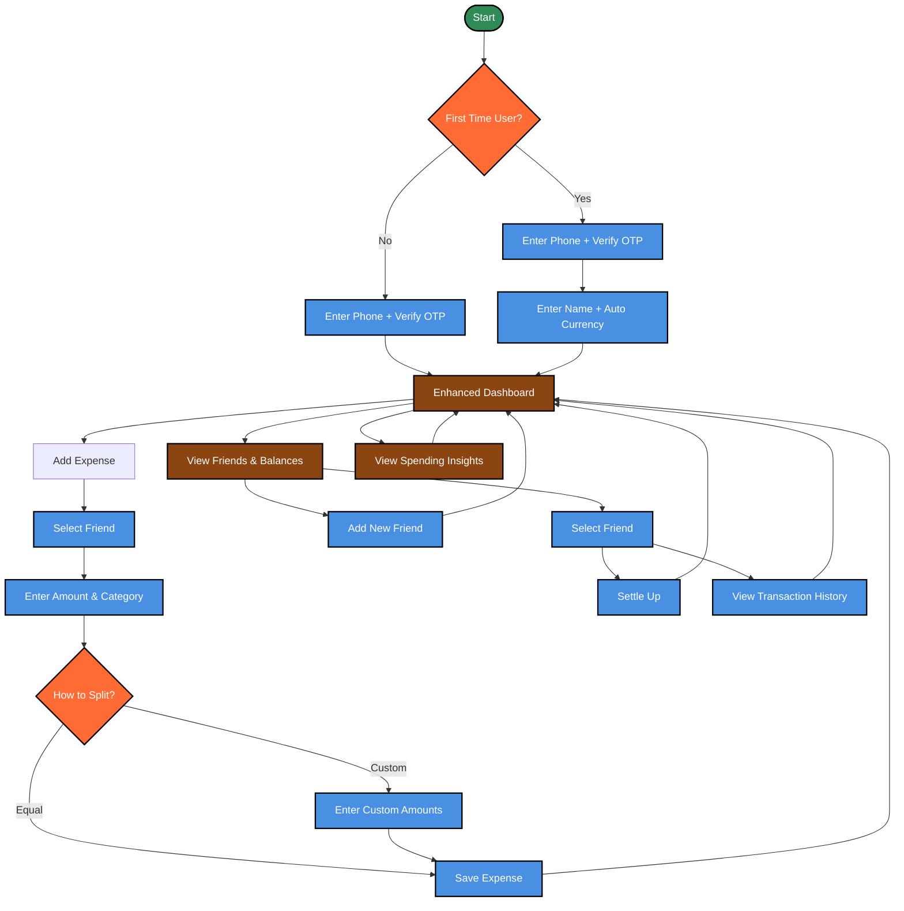

# Splitwise Alternative MVP

A modern expense splitting app focused on **faster expense entry** and **better spending insights** with enhanced UX.

## 🎯 MVP Goals

- **30-second expense entry** (vs 2+ minutes in Splitwise)
- **Real-time spending insights** with visual analytics
- **Phone-first authentication** for easy friend discovery
- **Simplified 1-on-1 splits** (no complex groups)

## 🏗️ Architecture

| Component | Technology | Purpose |
|-----------|------------|---------|
| **Frontend** | React Native (Expo) + TypeScript | Cross-platform mobile app |
| **Backend** | NestJS + PostgreSQL + Prisma | Scalable API with relational data |
| **Auth** | Clerk | Phone authentication with global SMS |
| **State** | Zustand | Lightweight state management |
| **UI** | React Native Paper | Material Design components |

## 🚀 Key UX Improvements

### Faster Expense Entry
- **Quick Add FAB** - Always accessible floating button
- **Recent Friends** - Most frequent friends shown first
- **Smart Defaults** - Remember categories and split methods
- **Swipe Actions** - Swipe right on friend for instant equal split
- **Skip Review** - Trusted patterns save without confirmation

### Better Spending Insights
- **Dashboard Snippets** - Quick insights cards on main dashboard
- **Dedicated Insights Page** - Full analytics and detailed charts
- **Net Balance** - Prominent "You owe" vs "You're owed" display
- **Category Breakdown** - Visual spending by category
- **Monthly Trends** - 30-day spending patterns
- **Friend Analytics** - Per-friend spending insights

### Simplified Onboarding
- **Phone + Name only** - Currency auto-detected
- **3-step tutorial** - Interactive first-time user guide
- **Skip optional fields** - Profile photos added later

## 📱 Core User Flows

### 1. Authentication
```
Phone Number → OTP Verification → Name + Currency → Dashboard
```

### 2. Add Expense (30s target)
```
FAB → Select Friend → Amount + Category → Split Type → Save
```

### 3. Manage Friends
```
View Friends → Add New OR Select Friend → Settle Up / View History
```

### 4. View Insights
```
Dashboard → Insights Page → Detailed Analytics → Back to Dashboard
```

## 🗂️ Project Structure

### Backend (NestJS)
```
backend/
├── src/
│   ├── auth/          # Clerk integration
│   ├── users/         # User profiles
│   ├── friends/       # Friend management
│   ├── expenses/      # CRUD + split calculations
│   ├── settlements/   # Settle up logic
│   ├── insights/      # Analytics queries
│   └── prisma/        # Database schema
```

### Frontend (Expo)
```
app/
├── (auth)/            # Authentication screens
│   ├── phone.tsx      # Phone input
│   ├── verify.tsx     # OTP verification
│   └── profile.tsx    # Name setup
├── (tabs)/            # Main app tabs
│   ├── index.tsx      # Dashboard (with insight snippets)
│   ├── friends.tsx    # Friends list
│   ├── insights.tsx   # Dedicated insights page
│   └── activity.tsx   # Recent transactions
├── expense/           # Expense management
│   ├── add.tsx        # Quick expense entry
│   └── [id].tsx       # Expense details
└── friend/            # Friend details
    └── [id].tsx       # Friend history
```

## 🗄️ Database Schema

### Core Models
- **Users**: `id, phone, name, currency, createdAt`
- **Friends**: `id, userId, friendName, friendPhone, balance, isAppUser`
- **Expenses**: `id, amount, description, category, date, createdBy`
- **Splits**: `id, expenseId, userId/friendId, amount, isPaid`
- **Settlements**: `id, fromUser, toUser, amount, date`

## 🎨 MVP Features

### ✅ Included
- Phone authentication only
- Equal and custom amount splits
- 1-on-1 friend splits
- Real-time balance updates
- Dashboard with insight snippets
- Dedicated insights page with full analytics
- Quick expense entry with FAB

### ❌ Excluded (Future Versions)
- Email authentication
- Multiple people paying
- Percentage/shares splits
- Group expenses
- Photo receipts
- Complex friend patterns

## 🧪 Testing Strategy

- **Backend**: Unit tests for split calculations (critical)
- **Frontend**: Manual testing (automated in v2)
- **E2E**: Core flow testing (signup → expense → settle)

## 🔧 Technology Decisions

### Why Clerk?
- Built-in phone auth with global SMS
- Secure session management
- Easy Expo integration
- Better DX than Firebase Auth

### Why Zustand?
- 10x less boilerplate than Redux
- Perfect for MVP speed
- Easy migration path to Redux

### Why PostgreSQL?
- ACID transactions for accurate splits
- Relational data fits naturally
- Better for analytics queries